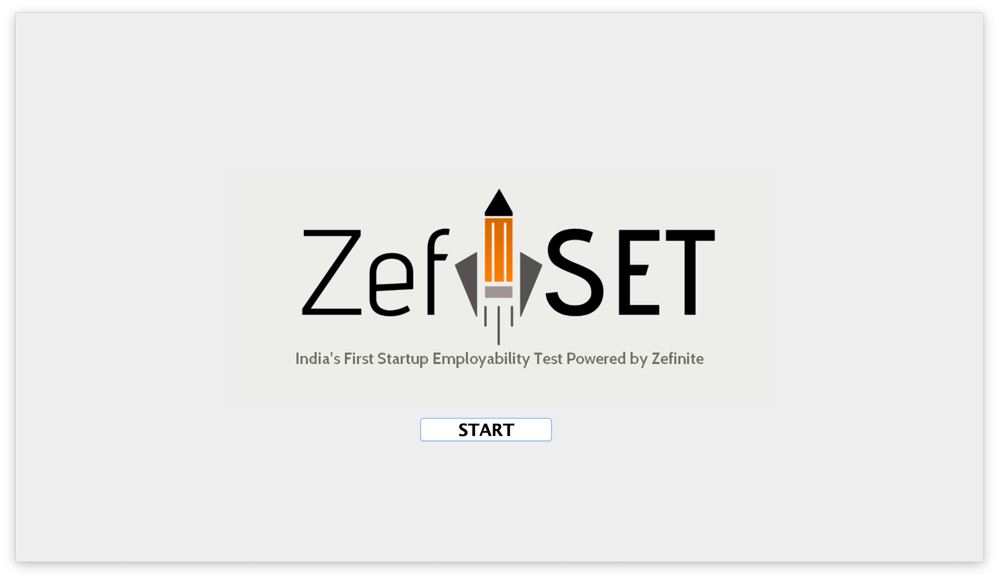
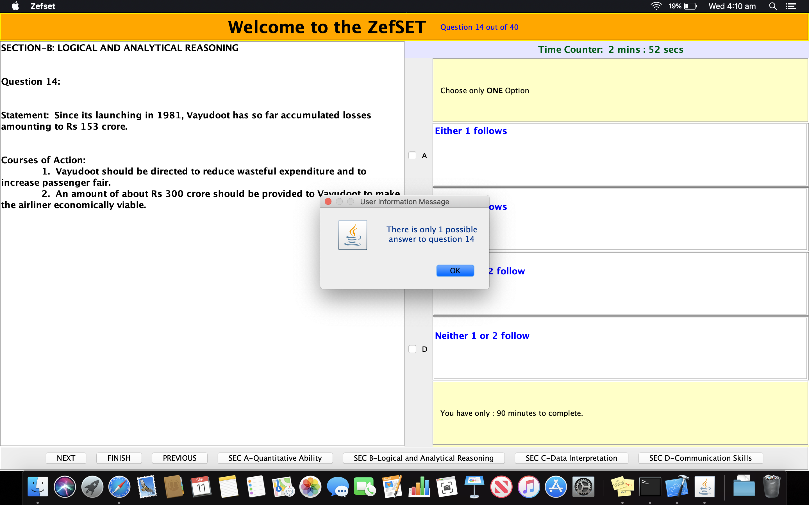
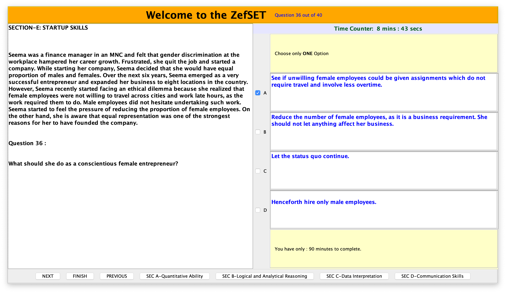
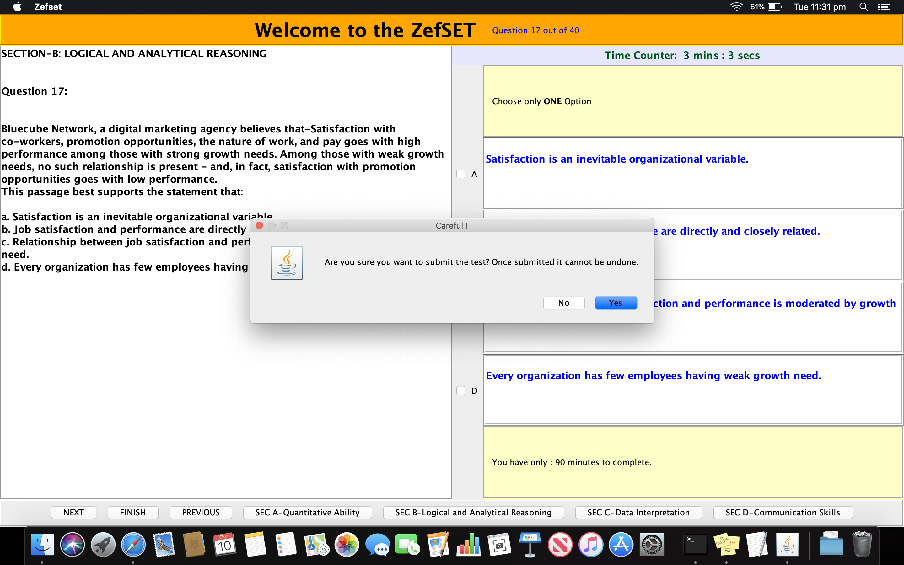

# Zefset-Test

- Zefset-Test is a java-based desktop application developed for Zefinite.
- Zefset-Test was used by Zefinite to conduct 'Zefset', a computer-based aptitude test for recruiting interns.

# Key takeaways

- Application developed in Java over an open source project. 
- GUI implemented by using Swings API.
- Object-Oriented design methodology adopted.
- Easy to use UX/UI.
- Timed test. Timer implemented via different thread (Multi-threading).
- Test results saved in a text file after completion/test submission.

# Dependencies

- Requires JDK 8 or higher to run the application.

# Steps to run the application

- Clone the repository.
- Install JDK 8 or higher.
- Open terminal. Change directory to the one saving the files. Example: cd /User/shivamgaur/Desktop/zefset if the files are saved in /User/shivamgaur/Desktop/zefset directory.
- Run Zefset.java (1. javac Zefset.java  2. java Zefset)
- Application starts running. 

- Enter applicant's name and id(roll number).
- Enter password(000111)to unlock the application.
- Read instructions.

- A prompt is generated to alert the user if more than one answer is selected as each question only has one correct answer.

- Timer on top-right indicates the time lapsed during the test.

- Application stops when timer runs out or submitted earlier by the candidate.
- A prompt alerts the applicant before submitting the test and asks for the confirmation.

- result.txt is created after test submission. It records the candidate's answers and the correct answers to each question. Finally calculates final marks (also includes negative marking for each wrong answer) before it is written and saved in the same directory.
