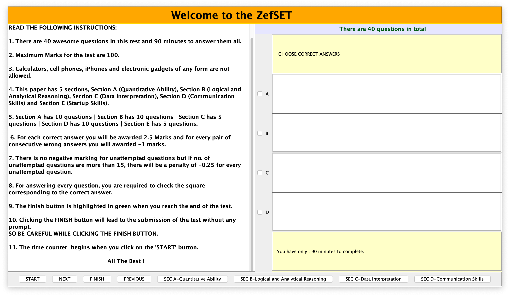

# Zefset-Test

- Zefset-Test is a java-based desktop application developed for Zefinite.
- Zefset-Test was used by Zefinite to conduct 'Zefset', a computer-based aptitude test for recruiting interns.

# Key takeaways

- Application developed in Java over an open source project. 
- GUI implemented by using Swings API.
- Object-Oriented design methodology adopted.
- Easy to use UX/UI.
- Timed test. Timer implemented via different thread (Multi-threading).
- Test results saved in a text file after completion/test submission.

# Dependencies

- Requires JDK 8 or higher to run the application.

# Steps to run the application

- Clone the repository.
- Install JDK 8 or higher.
- Open terminal. Change directory to the one saving the files.
- Run Zefset.java (1. javac Zefset.java  2. java Zefset)
- Application starts running. 

- Enter applicant's name and id(roll number).
- Enter password(000111).
- Read instructions.

- Application stops when timer runs out or submitted earlier by the candidate.
